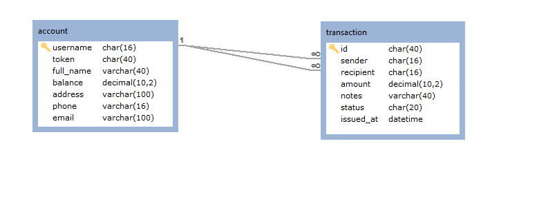

# Simple Bank

Simple Bank adalah sebuah bank digital (fiktif) berskala global yang menyediakan layanan perbankan layaknya bank konvensional. Seorang nasabah dapat memiliki satu atau lebih atau rekening (*account*).

Pada bank konvensional rekening diidentifikasi dengan normor rekening, hal ini berbeda dengan bank digital yang menggunakan username yang sifatnya unik.

Mata uang yang digunakan pada Simple Bank adalah USD guna menjamin penerimaannya di berbagai negara. Mata uang yang sama juga digunakan dalam transaksi yang melibatkan Simple Bank.

# Struktur Basis Data

Struktur basis data yang digunakan pada Simple Bank terdiri atas dua tabel, ***account*** dan ***transaction***. Struktur basis data dapat dilihat pada gambar berikut.



Anda dapat menemukan skrip basis data pada direktori ```/database```.

# Public APIs

Simple Bank mengembangkan beberapa fitur yang direalisasikan dalam bentuk REST API. Berikut adalah daftar fitur dan realisasi API yang dikembangkan, di antaranya:
1. [Account Detail](docs/account-detail.md);
2. [Issuing Transaction](docs/transaction-issue.md);
3. [Transaction Detail](docs/transaction-detail.md); dan
4. [Listing Transactions](docs/transaction-list.md).

# Installation And Configuration

Setelah meng-*clone* repositori ini, silakan untuk meng-*install* semua *dependency* dengan menjalankan perintah berikut ini pada *command line*
```
composer install
```
Silakan untuk men-*dump* skrip basis data yang digunakan. *Username* yang digunakan adalah ````simplebank``` dengan *password* ```simplebank000```. Anda dapat mengubah konfigurasi basis data dengan memodifikasi berkas ```.env```.
Selanjutnya, jalankan PHP *internal web server* dengan menjalankan perintah berikut pada *command line*
```
php -S localhost:80 -t public
```

# SoapUI Tests

Pada direktori ```/soapui``` telah disediakan beberapa contoh *requests* untuk menguji APIs.

# Challenge

Fitur *Transaction Detail* belum diimplementasi, silakan untuk merealisasikannya dengan *platform* apapun yang anda dapat pergunakan atau dengan mengembangkan *project* ini.

# New Feature (Exam)

Simple Bank meminta anda untuk melakukan penambahan fitur baru yang digunakan untuk meng-*update* beberapa atribut *account*. Fitur ini akan semakin melengkapi kapabilitas dari sistem yang dimiliki Simple Bank. Detil dari fitur ini dapat dilihat pada [dokumentasi terkait](docs/account-update.md);